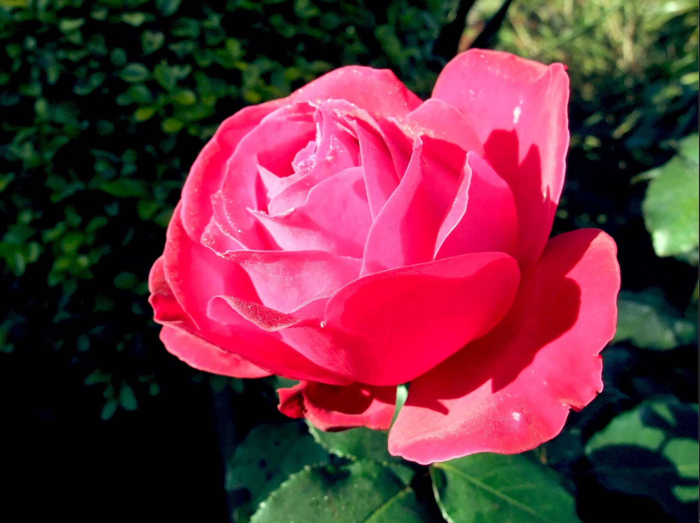

.. HSVTool Src Analysis documentation master file, created by
   sphinx-quickstart on Wed Jul 26 01:36:11 2017.
   You can adapt this file completely to your liking, but it should at least
   contain the root `toctree` directive.

HSVTool: Src Analysis Rectangle:
================================

.. toctree::
   :maxdepth: 2
   :caption: Contents:

**Natron Digital VFX Compositor** is an up and coming compositing powerhouse for open source compositing artist and vfx producers. Natron has many powerful and flexible  plugin nodes. Some of the nodes are developed as *OFX plugins* and some are PyPlug effects. The PyPlug effects are Natron’s internal nodes grouped together to form one more robust effect than the nodes operating by themselves.

.. note:: Original Google Image

The main node that I will be talking about briefly is the **HSVTool Node** that is use to shift an image/video color scheme, perform secondary color correction on certain regions of an image or be used as an image selection **keyer (color keyer)**. The above is an image that I pulled off google to give you and an example of how I had performed a **Secondary Color Correction** on the image. You will normally have to do some color grading or color corrections before you apply any secondary color corrections because your **shadows, midtones and highlights** can be unbalanced.

If your image is unbalanced, then your secondary color corrections will be unbalanced as well. If you look closely at the original rose and the graded rose, you can see that the graded rose shadows are deepen. The highlights doesn’t seem overly bright and the midtones sits a little better. Forgive me for my use of terms because audio engineering and mixing audio was my first love and still is.

.. note:: Graded Google Image

The **Grade Node** is the best node for this process because you are mapping your tones to their **correct ranges, luminance and chrominance**. To best way to do this is select your black points by first clicking the **Black Point color picker** and selecting the darkest pixel for the shadows. Then you click on the **White Point color picker** and select the brightess in the image. This is generally the standard way of grading your shots. You could also use this technique to fix white balancing issues when you don’t first perform the *white balancing on your dlsr, video camera or your mobile phone*. 

.. note:: Graded Node Setting

.. note:: Full Node Graph:

This full graph below is the result of the **HSVTool Node** after the grade node was use to map the shadows and highlights. I will have to say when I first wrote about this feature in a previous tutorial, I didn’t use a Grade node to first make my secondary changes. It took a while to get it look the way that it did. You can see the those images at <https://flic.kr/p/EhtNuS> and <https://flic.kr/p/EsW3mk>.

.. note:: Rosebush Full Graph-Changed

It will also help that you use the **HSVTool Node** output alpha sections because you can monitor or choose which part of the **Hue, Saturation and Brightness**, and etc masking effect.

.. note:: Rosebush Full Graph-Alpha
.. figure:: _images/rosebush-fullgraph-Alpha.jpg
		:width: 256px 
		:align: center

The **HSVTool** node **Src Analysis Rectangle** can be activated by clicking the checkbox. This activates the Src Rectangle overlay in the viewer. The rectangle is adjustable by clicking on any of the four corner points as well as the center knob to make it easier to move around the canvas.

.. note:: Rosebush Full Graph HSVTool Node:

I have noticed that the output alpha **(min(Hue,Saturation)** seems to be the most optimized mask to use for these kind of color replacements. This is not always the case because **min(All) Output Alpha** is sometimes the best way to go.